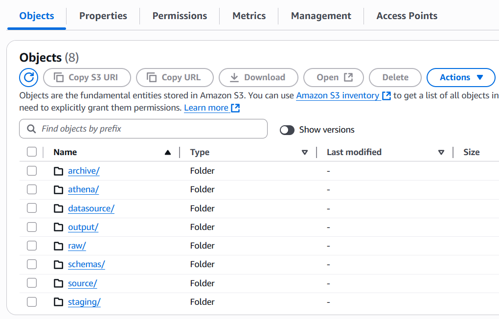
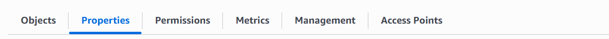
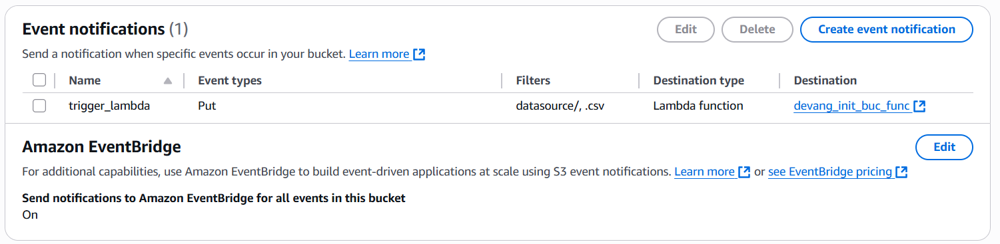
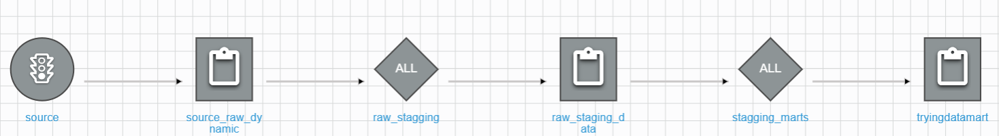

# AWS Synthea Healthcare Data Pipeline

This guide will walk you through setting up a complete ETL pipeline for **Synthea synthetic healthcare data** using:
- AWS Glue (ETL and Orchestration)
- AWS Lambda (trigger)
- Amazon S3 (storage)
- Amazon Athena (query)
- Power BI (visualization)

---

## Task 1: Generate Synthea Data (CSV Format)

### Download and Setup Synthea
- Download the Synthea project ZIP from GitHub:  
    https://github.com/synthetichealth/synthea

- Extract the folder and navigate to:

```
synthea/src/main/resources/synthea.properties
```

- **Enable CSV Output**:  
  Open `synthea.properties` and set:
  ```properties
  exporter.csv.export = true
  ```

### Run the Synthea Generator
Open terminal in the Synthea root directory and run:

```bash
./run_synthea -p <NUMBER_OF_PATIENTS>
```

 After completion, you'll see an `output/csv` folder with **18 CSV files**.

---

## Task 2: AWS Glue + Lambda Automation

### Create an S3 Bucket

- Go to **S3** and create a bucket (e.g., `synthea-data-pipeline`)
- Inside it, create these folders:
 



---

### Create AWS Glue Jobs

- Go to **AWS Glue → Jobs** and create Glue ETL scripts
- Set:
  - **Number of Workers**: According to your need
  - **Worker Type**: According to your need
  - **Concurrency**: According to your need
  - Add required **environment variables**

---

### Add Lambda Trigger

- Create a **Lambda function** to trigger Glue Job
- Increase Lambda timeout (e.g., 5 mins or more)
- Grant it proper **IAM permissions** to start Glue jobs

> **Attach the following IAM Policies**:
- `AWSGlueServiceRole`
- `AmazonS3FullAccess`
- `AWSLambdaBasicExecutionRole`
- `CloudWatchLogsFullAccess`

---

### Add Event Notification to S3

Go to:

**S3 → Properties → Event Notifications → Add Event**


- Name: `TriggerLambda`
- Event Type: `PUT`
- Prefix: `incoming/`
- Destination: Select your Lambda function

---

### Create Glue Workflow

Go to **AWS Glue → Workflows**  
- Create a new workflow and attach your Glue jobs in sequence.

> Refer to the image below for an example Glue Workflow setup:



---

## Task 3: Run the Pipeline

### Add Input Data

- Upload your **18 CSV files** into `datasource/` folder in your S3 bucket.

---

### Monitor Execution

- **Lambda Logs**:  
  Go to **CloudWatch → Log Groups → /aws/lambda/<your_lambda>**

- **Glue Job Monitoring**:  
  Go to **AWS Glue → Jobs → Monitor Runs**

>  Refresh the page manually if Glue run status doesn’t auto-update.

---

###  Query with Amazon Athena

1. Go to **Athena → Settings** and set query result location (e.g., `s3://synthea-data-pipeline/athena-results/`)
2. Select the database created by Glue jobs
3. Write SQL queries to explore the data

---


## Notes

- Always test Lambda with smaller datasets first
- Ensure S3, Glue, and Lambda are in the **same region**
- Update concurrency and memory limits based on job performance
- Monitor failed job runs in **CloudWatch Logs**
